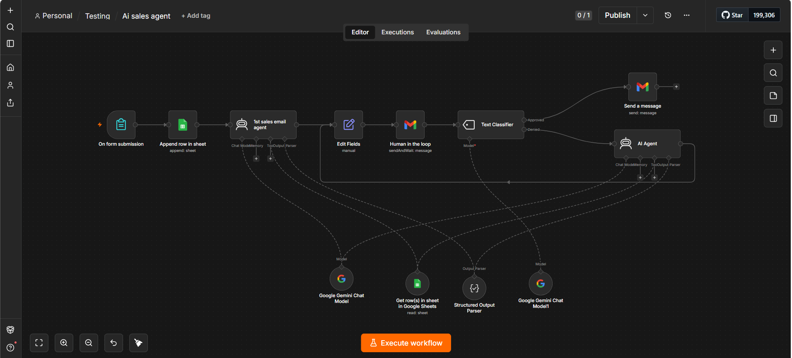

# AI Sales Agent

## Overview

This project is an AI-powered sales qualification workflow built with **n8n**. It automates the complete lead handling process from form submission to sales response while keeping a human approval step before contacting customers.

The workflow combines **AI decision-making**, **Google Workspace integrations**, and **human validation** to reduce manual work and ensure that only qualified responses are sent automatically.

---

# Business Problem

Sales teams often spend significant time reviewing incoming leads, checking customer information, deciding whether a lead should receive an automated response, and manually sending emails.

This workflow eliminates repetitive administrative tasks while maintaining human control over customer communication.

---

# Solution

The workflow automatically:

1. Receives a new lead from a submitted form.
2. Stores the lead inside Google Sheets.
3. Uses an AI agent to analyze the lead.
4. Generates a proposed sales response.
5. Sends the response to a human reviewer for approval.
6. Classifies the review decision.
7. Sends the email automatically if approved.
8. If rejected, routes the conversation to another AI agent for revision before continuing.

---

# Workflow Architecture

```
Customer Form
      │
      ▼
Google Sheets
      │
      ▼
AI Sales Agent
      │
      ▼
Prepare Response
      │
      ▼
Human Approval
      │
      ▼
Decision Classifier
 ┌──────────────┐
 │              │
 ▼              ▼
Approved     Rejected
 │              │
 ▼              ▼
Send Email   AI Revision
```

---

# Technologies Used

- n8n
- Google Gemini
- Google Sheets API
- Gmail API
- Human-in-the-Loop Validation
- AI Agent
- Structured Output Parser
- Text Classification

---

# Workflow Logic

### 1. Form Trigger

Starts the automation whenever a new customer submits the sales form.

---

### 2. Google Sheets

Stores every incoming lead to create a persistent sales database.

---

### 3. AI Sales Agent

The AI agent analyzes the customer information and prepares an initial sales response using Google Gemini.

Responsibilities include:

- understanding customer intent
- generating personalized replies
- preparing structured outputs
- retrieving contextual information when required

---

### 4. Edit Fields

Formats the AI output into the structure required for the review process.

---

### 5. Human Approval

A sales representative reviews the AI-generated response before it reaches the customer.

This keeps the workflow safe while allowing AI to automate most of the work.

---

### 6. Text Classifier

Analyzes the human reply and determines whether the response was:

- Approved
- Rejected

---

### 7. Approved Path

If approved, Gmail automatically sends the response to the customer.

---

### 8. Rejected Path

If rejected, the workflow routes the request back to another AI agent to generate an improved response before continuing.

---

# AI Components

This workflow uses multiple AI capabilities:

- Natural Language Understanding
- Response Generation
- Decision Classification
- Structured Output Generation
- Context-aware Sales Responses

---

# Automation Benefits

- Reduces manual sales work
- Faster customer response times
- Human approval before sending
- Centralized lead storage
- Consistent communication
- AI-assisted sales qualification
- Scalable workflow architecture

---

# Skills Demonstrated

- AI Workflow Design
- n8n Automation
- Prompt Engineering
- API Integration
- Google Workspace Automation
- Human-in-the-Loop Systems
- AI Decision Pipelines
- Workflow Debugging
- Business Process Automation

---

# Repository Contents

```
AI-Sales-Agent/
│
├── AI sales agent.json
├── workflow.png
└── README.md
```

---

# Preview


---

# Future Improvements

- CRM Integration (HubSpot / Salesforce)
- Automatic Follow-up Sequences
- Lead Scoring
- Multi-language Responses
- Slack Notifications
- Analytics Dashboard

---

**Author**

Fatma Hussein

AI Automation Engineer

Built with n8n 
