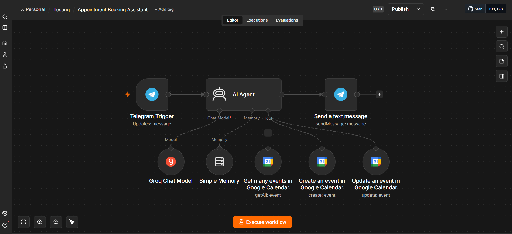

Appointment Booking Assistant
Overview

An AI-powered appointment booking workflow built with n8n. The workflow handles customer messages through Telegram, checks Google Calendar availability, and helps customers book, reschedule, or cancel appointments in their preferred language.

Features
Handles customer requests through Telegram.
Checks appointment availability using Google Calendar.
Books, updates, and cancels appointments.
Replies in Arabic or English.
Maintains conversation context using AI memory.
Provides friendly and concise customer support.
Tech Stack
n8n
Telegram API
Google Calendar
Groq LLM
OpenAI GPT-OSS Safeguard
AI Memory
