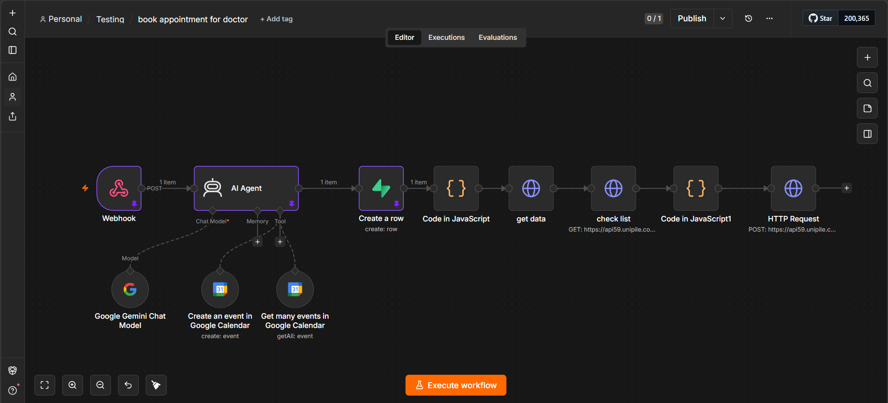

## Overview

An automated doctor appointment booking system built with **n8n** and connected to a website created using **Vibe Coding**. The website sends appointment requests to n8n through a **Webhook**, where the AI Agent checks Google Calendar availability, confirms the booking, saves the appointment in Supabase, and sends a confirmation message via WhatsApp.

## Features

- Connects a Vibe-Coded website to n8n using a Webhook.
- Receives patient appointment requests from the website.
- Checks Google Calendar for available time slots.
- Prevents double booking.
- Saves confirmed appointments in Supabase.
- Creates calendar events automatically.
- Sends booking confirmations via WhatsApp.
- Uses AI to process appointment requests.

## Tech Stack

- n8n
- Vibe Coding
- Google Gemini
- Google Calendar
- Supabase
- WhatsApp API (Unipile)
- JavaScript
