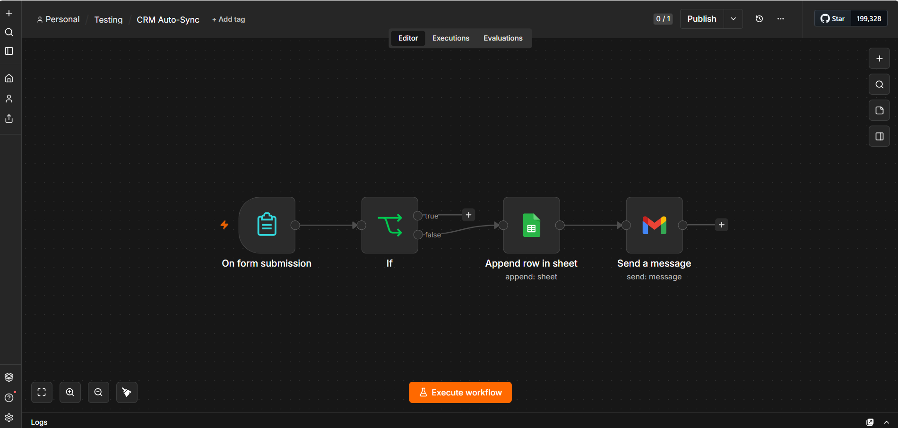

# CRM Auto-Sync

## Overview

An automated CRM data management workflow built with n8n. The workflow collects customer information through a form, stores the submitted data in Google Sheets, and sends a confirmation email after processing the submission.

## Features

- Collects customer information through a form.
- Stores customer data automatically in Google Sheets.
- Validates submitted customer information.
- Sends a confirmation email to the customer.
- Automates CRM data management.

## Tech Stack

- n8n
- n8n Forms
- Google Sheets
- Gmail
