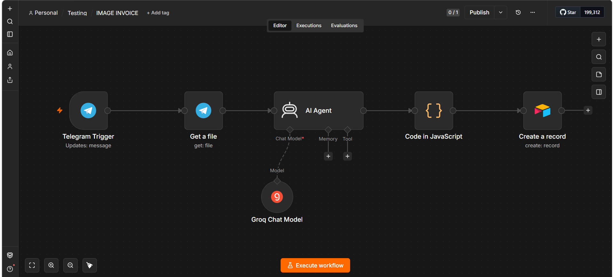

IMAGE INVOICE

## Overview

An AI-powered invoice data extraction workflow built with n8n. The workflow receives invoice images through Telegram, extracts key invoice information using an AI agent, processes the extracted data, and stores it in Airtable.

## Features

-Receives invoice images through Telegram.
-Extracts invoice details using AI.
-Processes and cleans extracted data.
-Stores structured invoice data in Airtable.
-Handles missing invoice information.
-Supports invoice and payment status tracking.

## Tech Stack

-n8n
-Telegram API
-Groq LLM
-Airtable
