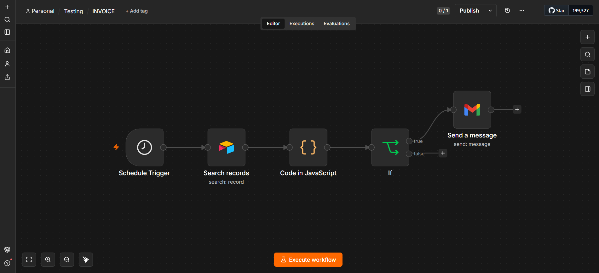

# Invoice

## Overview

An automated invoice reminder workflow built with n8n. The workflow checks invoice records in Airtable, calculates the remaining time until the due date, identifies unpaid invoices that are due within 5 days, and sends an email reminder.

## Features

- Checks invoice records automatically.
- Calculates remaining days until the due date.
- Identifies unpaid invoices due within 5 days.
- Generates a personalized payment reminder.
- Sends invoice reminders via Gmail.

## Tech Stack

- n8n
- Airtable
- Gmail
- JavaScript
