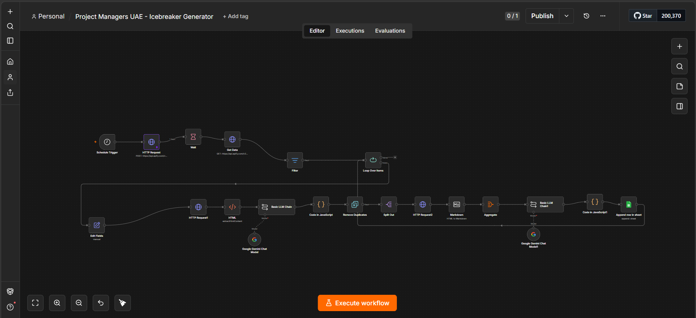

# AI Ice Breaker Generator

## Overview

An AI-powered lead engagement workflow built with **n8n**. It analyzes lead information and the company's website to understand the business, then generates a personalized ice breaker tailored to each potential customer. This helps create more relevant and natural outreach messages.

## Features

- Automatically processes lead information.
- Analyzes the company's website to understand its business.
- Uses AI to generate personalized ice breakers.
- Creates relevant conversation starters based on each company.
- Reduces manual research and message-writing time.
- Helps improve personalized outreach and lead engagement.

## Tech Stack

- n8n
- AI / LLM
- JavaScript
