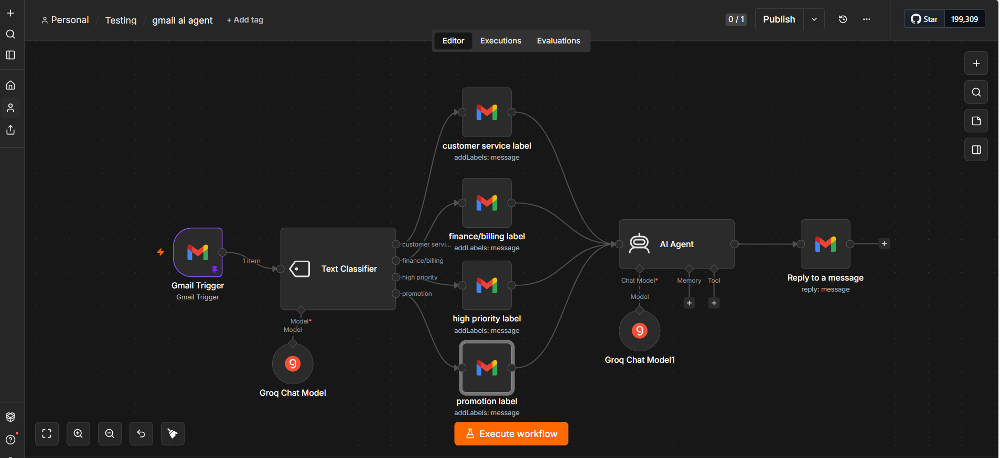

# Gmail AI Agent

## Overview
An AI-powered email automation workflow built with **n8n**. The workflow monitors incoming Gmail messages, classifies them into predefined categories, applies the appropriate Gmail label, and generates a professional AI reply in the same language as the original email.

## Features
- Monitors new Gmail emails automatically.
- Classifies emails into predefined categories.
- Applies the appropriate Gmail label.
- Generates context-aware AI replies.
- Replies in English or Arabic.
- Skips promotional emails.

## Tech Stack
- n8n
- Gmail API
- Groq LLM
