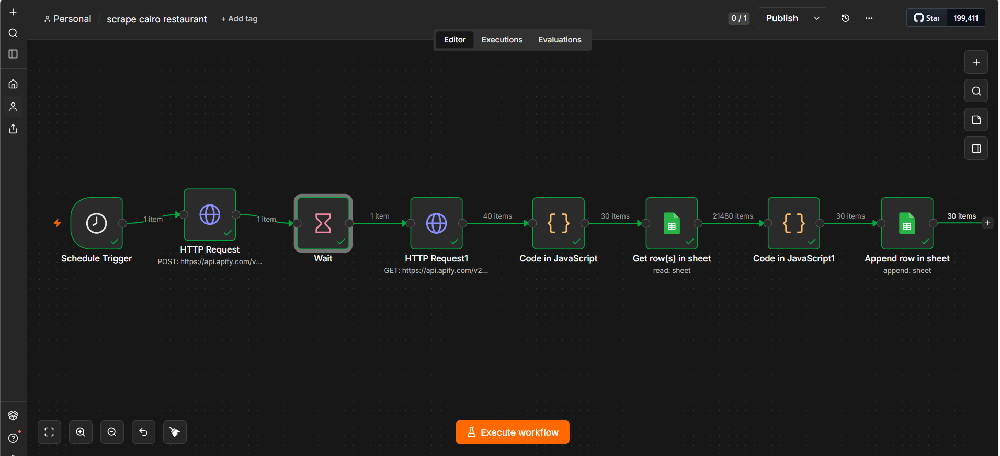

# Cairo Restaurant Scraper

## Overview
An automated lead generation workflow built with **n8n**. It collects restaurant data from Google Maps using the Apify API, cleans and filters the results, removes duplicates, and stores unique records in Google Sheets. The collected data can be used to identify restaurants that may need a website.

## Features
- Automatically collects restaurant data from Google Maps.
- Extracts contact details and business information.
- Filters out records without phone numbers.
- Removes duplicate entries before saving.
- Appends only new restaurants to Google Sheets.

## Tech Stack
- n8n
- Apify API
- Google Maps
- Google Sheets API
- JavaScript
